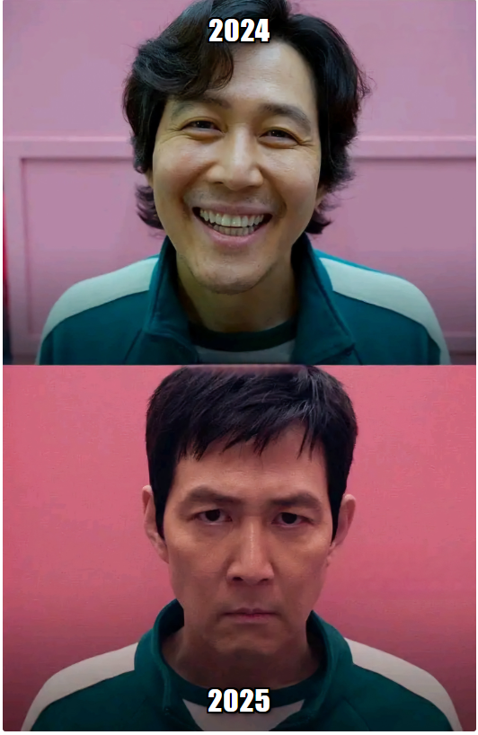

# Meme Generator 🎭

A simple meme generator built using **React**, `useState`, `useEffect`, and the [Imgflip Meme API](https://api.imgflip.com/get_memes). This app allows users to generate random meme images and customize the text.

## 📸 Features
- Fetches meme images from the Imgflip API
- Allows users to add custom **top** and **bottom** text
- Generates a new random meme image on button click
- Responsive design for better user experience

---

*Example meme generated with this website.*



---

## 🚀 Technologies Used
- React (useState, useEffect)
- Fetch API
- CSS for styling

## 🛠️ Installation & Setup
1. Clone the repository:
   ```sh
   git clone https://github.com/your-username/meme-generator.git
